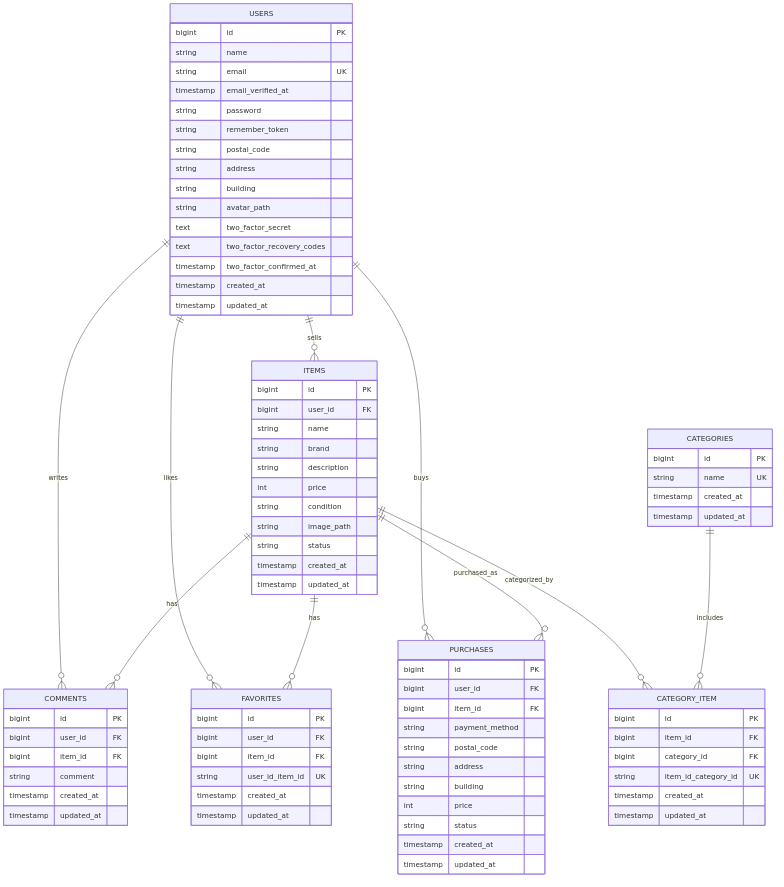
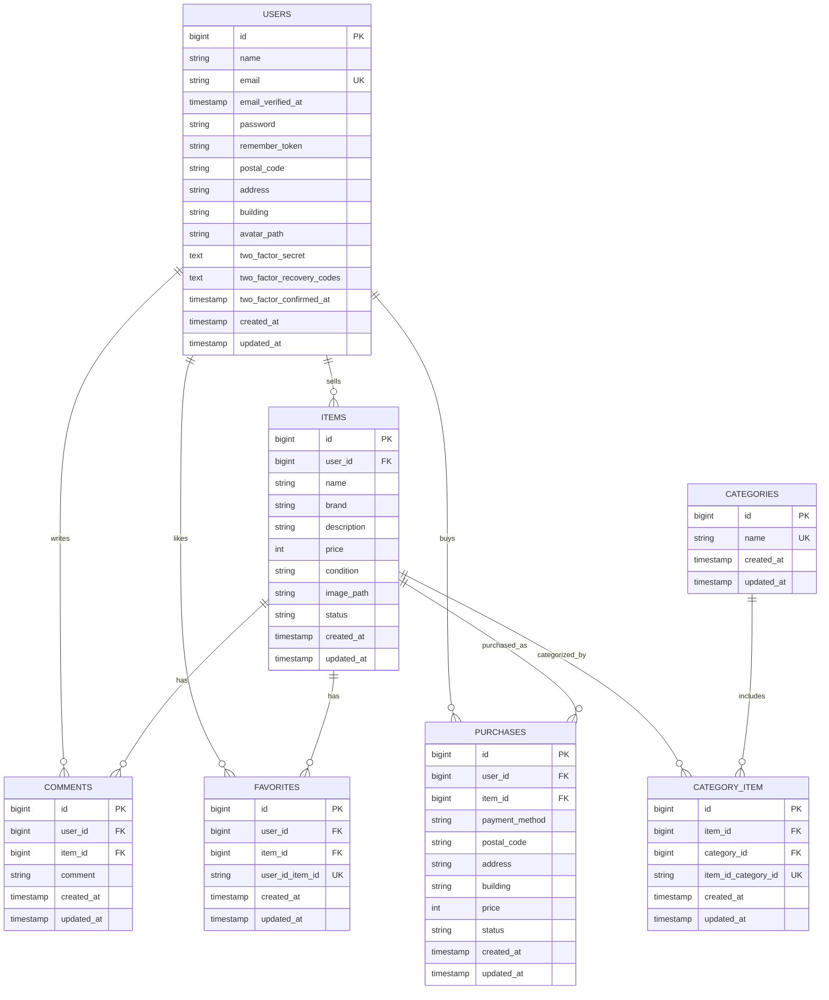

# ER図

業務テーブル（`users`, `items`, `categories`, `category_item`, `comments`, `favorites`, `purchases`）のER図です。  
現在はカテゴリを `items.category_id` ではなく、`category_item` で多対多管理しています。
購入データ（`purchases`）は、Stripe有効時はCheckout完了後（`payment_status=paid`確認後）に保存されます。
- `favorites` は (`user_id`, `item_id`) の複合ユニーク制約があります。
- `category_item` は (`item_id`, `category_id`) の複合ユニーク制約があります。

- Mermaid定義: `docs/er.mmd`
- 提出用画像: `docs/er.png`

